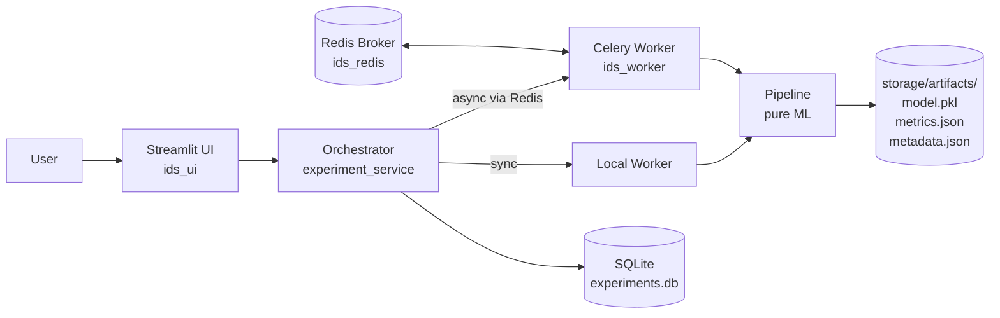

# IDS Research Pipeline Execution System

> A web-based, on-premise platform for **reproducible** machine learning experiments on Intrusion Detection System (IDS) datasets.

[](https://www.python.org/)
[](https://streamlit.io/)
[](https://docs.docker.com/compose/)
[](https://docs.celeryq.dev/)
[](https://scikit-learn.org/)
[](#testing)
[](#academic-context)
[](#license)

---

## Overview

The IDS Research Pipeline Execution System is a **research platform** for running fixed, paper-faithful machine learning pipelines on intrusion detection datasets. It is designed primarily for a single researcher running thesis-grade experiments and was built around one engineering goal: **bit-identical reproducibility** of every reported metric.

Given a CSV/NDJSON dataset and a pipeline selection, the system:

1. Validates the file against a known schema and computes its SHA-256 hash.
2. Trains the model using **locked, hard-coded hyperparameters** (no user-configurable knobs).
3. Evaluates with standard metrics (accuracy, precision, recall, F1, ROC-AUC, confusion matrix, per-class report) plus a learning curve.
4. Persists the trained model, all metrics, and metadata to disk under a per-experiment artifact directory.
5. Records the run in a local SQLite database, browsable through a Streamlit UI with downloadable PDF reports.

This is not a production IDS, not a real-time detector, and not a multi-tenant service. It is research infrastructure for controlled, reproducible offline experiments. See [Known Limitations](#known-limitations) below.

---

## Key Features

- **Locked pipelines, no UI hyperparameter tuning.** Every algorithm parameter is hard-coded in source. This is the platform's core methodological contribution.
- **11 registered ML pipelines** across 3 dataset families (see [Pipelines](#pipelines)).
- **Reproducibility by construction**: every stochastic step uses `random_state=42`, every split is `stratify=y`, every dataset is SHA-256 hashed and the hash is persisted to the experiment record.
- **Dual execution modes**: synchronous (in-process) or asynchronous (Celery + Redis). Toggled via `USE_ASYNC` environment variable.
- **Web UI (Streamlit)** with 4 pages: Tutorial, Run Experiment, Experiment History (AgGrid), Environment Info.
- **PDF report generation** per experiment, including metric cards, confusion matrix, ROC curve, learning curve, feature importance, and classification report.
- **Containerized deployment** via Docker Compose. Three services: `ids_ui`, `ids_worker`, `ids_redis`.
- **Test suite** of 196 collected tests, including parametrized cross-pipeline reproducibility checks.
- **Cross-environment path fallback** so an experiment dispatched from one OS resolves dataset files correctly on a worker running in another (e.g., Docker worker reading a Windows-style path).

---

## Architecture

The codebase is organized into strict layers with one-way import boundaries:

```
ui/                ← Streamlit views; talks only to orchestrator/ + config/
orchestrator/      ← Business logic; only DB-writing layer
workers/           ← Sync (local) and async (Celery) executors
pipelines/         ← Pure ML; no DB, no UI, no orchestrator imports
contracts/         ← Cross-layer dataclasses (PipelineInput, PipelineResult)
database/          ← SQLite CRUD + migrations
config/            ← Paths, settings, pipeline registry, Celery config
utils/             ← Hashing, artifact saving, PDF generator, logging, sanitizer
storage/           ← Datasets (input) and artifacts (output); mounted as volume
tests/             ← pytest suite
docker/            ← UI and worker Dockerfiles
run_pipeline.py    ← CLI runner (alternative to UI)
```

**Hard import rule:** `pipelines/` must never import from `database/`, `ui/`, `orchestrator/`, or `workers/`. `orchestrator/experiment_service.py` is the only file that writes to the database.

### Component flow



---

## Pipelines

All pipelines are registered in [`config/pipeline_registry.py`](config/pipeline_registry.py) and follow the `PipelineResult` contract in [`contracts/pipeline_contracts.py`](contracts/pipeline_contracts.py).

### CICIDS2017 (1 pipeline)

| Pipeline ID | Algorithm | Reference |
|---|---|---|
| `cicids2017.rf_paper_a` | Random Forest + RFE | Sharafaldin et al., ICISSP 2018 |

### HIKARI2021 (6 pipelines)

All HIKARI2021 pipelines use a stratified 70/30 train/test split.

| Pipeline ID | Algorithm | Preprocessing notes |
|---|---|---|
| `hikari2021.rfc_pipeline` | Random Forest (100 trees) | RandomUnderSampler on train only; StandardScaler fit on balanced train |
| `hikari2021.dt_pipeline` | Decision Tree | None |
| `hikari2021.knn_pipeline` | K-Nearest Neighbors (k=5) | RandomUnderSampler on train only; StandardScaler fit on balanced train |
| `hikari2021.svc_pipeline` | SVC (`probability=True`) | None — UI shows runtime warning (O(n²)); learning curve uses cv=3 |
| `hikari2021.nbgc_pipeline` | Gaussian Naive Bayes | None |
| `hikari2021.lr_pipeline` | Logistic Regression | StandardScaler + PCA(95% variance), both **fit on train only** (no leakage) |

### EVE Suricata (4 pipelines)

All four EVE pipelines share an identical Phase 1–9 preprocessing chain (`pipelines/eve_suricata/phase_runner.py`); only `_train_and_extract()` differs per pipeline.

| Pipeline ID | Algorithm | Features used |
|---|---|---|
| `eve_suricata.rfc` | Random Forest (100 trees) | RFE top-25 |
| `eve_suricata.dt`  | Decision Tree | RFE top-25 |
| `eve_suricata.knn` | K-Nearest Neighbors (k=5) + StandardScaler | MI top-25 |
| `eve_suricata.xgb` | XGBoost (100 trees) | MI top-25 |

**Shared phase chain (1–9):** Load & Label (NDJSON, 2-pass disk-backed) → Feature Engineering → Computed Features → Aggressive Cleaning → Correlation Analysis → Stratified Train/Test Split → Feature Selection (MI + RFE + PCA).

> XGBoost is a soft dependency. If the `xgboost` package is unavailable, only `eve_suricata.xgb` raises `ImportError`; other pipelines are unaffected.

---

## Tech Stack

| Layer | Technology |
|---|---|
| UI | Streamlit, streamlit-option-menu, streamlit-aggrid |
| ML | scikit-learn, imbalanced-learn, XGBoost (optional) |
| Async execution | Celery + Redis (broker & result backend) |
| Persistence | SQLite (stdlib `sqlite3`, WAL mode), filesystem artifacts |
| Reporting | ReportLab (PDF), matplotlib |
| Packaging | `pip install -e .` via `pyproject.toml`; Python ≥ 3.10 |
| Container runtime | Docker + Docker Compose v2; Python 3.11-slim base image |

Full dependency list lives in [`requirements.txt`](requirements.txt).

---

## Prerequisites

- **Docker** (recommended) — Docker Desktop with Compose v2, or Docker Engine + Compose.
- Sufficient memory available to the Docker backend. Recommended: **≥ 8 GB** for HIKARI2021 (ALLFLOWMETER variant is ~302 MB CSV and learning-curve fitting is memory-intensive). On WSL2, configure via `%USERPROFILE%\.wslconfig`.
- Disk: ≥ 5 GB free for image build + artifact storage; more if you run many experiments.

For local (non-Docker) development:

- Python 3.10 or 3.11
- Redis (only if running async mode locally)

---

## Getting Started (Docker — recommended)

```powershell
# 1. Clone
git clone <your-repo-url>
cd <repo>

# 2. Place dataset files
#    See "Preparing Datasets" below. storage/datasets/ is mounted into both containers.

# 3. Build the images
docker compose build

# 4. Start the stack
docker compose up -d --remove-orphans

# 5. Open the UI
#    Streamlit runs on http://localhost:8501
```

`--remove-orphans` is recommended on every start: it cleans up auto-named containers from previous runs that share the same image but have no Compose service binding.

Useful follow-ups:

```powershell
# Tail worker logs
docker compose logs -f worker

# Inspect what env the worker process actually sees
docker compose exec worker env | findstr CELERY

# Stop everything
docker compose down
```

After any code change, rebuild the images so the running containers pick up the change (Dockerfiles use `COPY . .`, source is baked at build time):

```powershell
docker compose down
docker compose build --no-cache
docker compose up -d --remove-orphans
```

---

## Getting Started (Local — Python venv, no Docker)

For developers iterating on UI or pipeline code locally:

```powershell
python -m venv venv
.\venv\Scripts\activate          # PowerShell on Windows
pip install -r requirements.txt
pip install -e .                  # makes the package importable everywhere

streamlit run ui/app.py           # synchronous mode (USE_ASYNC unset / false)
```

Async mode locally requires Redis on `localhost:6379`. The default broker URL in [`config/celery_config.py`](config/celery_config.py) is `redis://localhost:6379/0`, overridden in Docker by `CELERY_BROKER_URL=redis://redis:6379/0`.

---

## Preparing Datasets

Datasets are read-only inputs at runtime — the UI does **not** include a file uploader. Place files directly in `storage/datasets/` before starting the stack:

```
storage/datasets/
├── <your CICIDS2017 file>.csv
├── ALLFLOWMETER_HIKARI2021.csv
└── eve_100k.json                 # NDJSON (one JSON object per line)
```

Supported file formats per dataset type (from [`contracts/dataset_schemas.py`](contracts/dataset_schemas.py)):

- **CICIDS2017** — `.csv`, 78 feature columns + `Label`.
- **HIKARI2021** — `.csv` (ALLFLOWMETER variant), 88 columns including `traffic_category` and `Label`.
- **EVE_SURICATA** — `.json` NDJSON (one JSON object per line). Required top-level keys: `timestamp`, `flow_id`, `event_type`, `src_ip`, `src_port`, `dest_ip`, `dest_port`, `proto`. Binary label `Target` is derived inside the pipeline from `alert.severity`.

Dataset files are **never written to** at runtime. They are hashed (SHA-256) and read into memory only.

---

## Usage

### Via the Streamlit UI

1. Open **http://localhost:8501**.
2. Use the sidebar to navigate (Tutorial, Run Experiment, History, Environment Info).
3. In **Run Experiment**: pick a dataset type, choose a file detected from `storage/datasets/`, click **Validate Dataset**, then pick a compatible pipeline and click **Run Experiment**.
4. Watch the live progress panel; on completion, metrics, charts, and a **Download PDF Report** button appear.
5. Browse past runs in **History** (AgGrid table with filtering and re-run).

### Via the CLI runner

```powershell
python run_pipeline.py --list-pipelines

python run_pipeline.py `
  --dataset storage/datasets/ALLFLOWMETER_HIKARI2021.csv `
  --dataset-type HIKARI2021 `
  --pipeline hikari2021.rfc_pipeline
```

The CLI is synchronous (does not require Redis/Celery).

---

## Reproducibility

This is the platform's design center. The following invariants are enforced project-wide:

1. **`random_state=42` everywhere** — splits, samplers, classifiers, and learning-curve calls.
2. **`stratify=y` on every split** — critical for HIKARI2021's severe class imbalance.
3. **No data leakage** — scalers, samplers, and PCA are fit on the training partition only. (One exception lived in the original LR notebook; the production LR pipeline corrects it — both StandardScaler and PCA are fit on `X_train` post-split.)
4. **Locked hyperparameters** — hard-coded in each pipeline file; no UI controls, no config overrides, no function arguments expose them.
5. **Dataset SHA-256 hash** — recorded in `experiments.dataset_hash` and `metadata.json` for every run. Lets you detect silent dataset edits between runs.
6. **`PipelineResult` is a stable contract** — extras go in `extra_info: dict` so adding metrics never breaks downstream readers.

A "test it twice and compare" pattern is enforced in the test suite (`test_reproducibility` style cases) for each pipeline.

### Computation parallelism note

All `n_jobs` parameters across pipelines are pinned to `2` (not `-1`). This is a deliberate choice for memory safety on smaller dev/CI machines and consistent narrative across all runs. `n_jobs` is a computation knob, not a model hyperparameter; changing it does not affect the trained model or its metrics — only wall-clock time.

---

## Project Structure

```
.
├── ui/                            Streamlit application
│   ├── app.py                     Entry point (sidebar routing)
│   └── views/
│       ├── tutorial.py            Usage guide
│       ├── run_experiment.py      Run + monitor experiments
│       ├── view_results.py        History (AgGrid) + detail view
│       ├── environment_info.py    Python, deps, paths
│       └── _artifact_browser.py   Read-only artifact viewer
├── orchestrator/                  Business logic
│   ├── experiment_service.py      Only DB-writing facade
│   ├── execution_service.py       Pipeline dispatch
│   ├── validation_service.py      Schema validation
│   ├── result_service.py          Read-only result retrieval
│   ├── dataset_parser.py          CSV / NDJSON parsing
│   └── validator.py               Column-set check
├── workers/
│   ├── local_worker.py            Synchronous executor
│   └── celery_worker.py           Async Celery task
├── pipelines/
│   ├── base.py                    BasePipeline abstract class
│   ├── cicids2017/
│   ├── hikari2021/                6 paper-faithful pipelines
│   └── eve_suricata/
│       ├── phase_runner.py        Shared 11-phase chain
│       ├── phases/                phase1..phase9 modules
│       ├── rfc_pipeline.py
│       ├── dt_pipeline.py
│       ├── knn_pipeline.py
│       └── xgb_pipeline.py
├── database/
│   ├── models.py                  Schema constants (one table: experiments)
│   ├── db.py                      sqlite3 CRUD
│   └── migration.py               Schema versioning
├── contracts/
│   ├── pipeline_contracts.py      PipelineInput / PipelineResult
│   └── dataset_schemas.py
├── config/
│   ├── settings.py                Paths, env detection
│   ├── pipeline_registry.py       Registry of all pipelines
│   └── celery_config.py           Broker / backend / USE_ASYNC
├── utils/
│   ├── hashing.py                 SHA-256 with cross-env path fallback
│   ├── artifact_saver.py          Write model + metrics + metadata
│   ├── report_generator.py        Modular PDF report (9 sections)
│   ├── error_sanitizer.py         Strip absolute paths from error strings
│   ├── timestamps.py
│   └── logging_config.py
├── storage/
│   ├── datasets/                  Input files (gitignored)
│   ├── artifacts/{exp_id}/        model.pkl, metrics.json, metadata.json
│   └── experiments.db             SQLite (WAL mode)
├── tests/                         pytest suite (196 collected)
├── docker/
│   ├── Dockerfile                 UI image
│   └── worker.Dockerfile          Celery worker image
├── docker-compose.yml             Three-service stack
├── requirements.txt
├── pyproject.toml
└── run_pipeline.py                CLI runner
```

---

## Database Schema

A single table, `experiments`, defined in [`database/models.py`](database/models.py):

| Column | Type | Notes |
|---|---|---|
| `id` | TEXT | Experiment UUID, primary key |
| `dataset_type` | TEXT | `CICIDS2017` \| `HIKARI2021` \| `EVE_SURICATA` |
| `dataset_path` | TEXT | Path captured at submission time |
| `dataset_hash` | TEXT | SHA-256 hex |
| `pipeline_id` | TEXT | Registry key |
| `status` | TEXT | `QUEUED` \| `RUNNING` \| `FINISHED` \| `FAILED` |
| `created_at`, `started_at`, `completed_at` | TEXT | ISO 8601 |
| `accuracy`, `precision_score`, `recall`, `f1_score` | REAL | Top-line metrics; full metrics live in `metrics.json` |
| `metrics_path`, `model_path` | TEXT | Artifact paths |
| `error_message` | TEXT | Sanitized error string on FAILED |
| `task_id` | TEXT | Celery task id for async runs |

SQLite is opened in WAL mode for safer concurrent read-while-write.

---

## Testing

```powershell
# Full suite
.\venv\Scripts\python.exe -m pytest tests/ -q

# Focused subsets (examples)
pytest tests/test_db.py tests/test_migration.py -v
pytest tests/test_validator.py tests/test_parser.py -v
pytest tests/test_pipeline_rf.py -v
pytest tests/test_hikari_all_pipelines.py -v
pytest tests/test_eve_pipeline.py -v
pytest tests/test_experiment_service.py -v
pytest tests/test_path_fallback.py -v
```

At the time of writing, `pytest --collect-only -q` reports **196 tests collected**. The suite covers:

- Database CRUD + migrations (per-test isolated SQLite via `tmp_path`)
- Schema validators and dataset parser
- Each pipeline end-to-end on synthetic schema-conforming DataFrames (no real CSV needed)
- A parametrized HIKARI2021 cross-pipeline test (multiple pipelines × multiple assertions)
- Orchestrator services and execution service
- Artifact saving + path-resolution fallback
- Error sanitizer and Celery progress reporting

No mocked ML models — pipelines run real `sklearn` fits on synthetic data.

---

## Adding a New Pipeline

1. Create `pipelines/{dataset}/your_pipeline.py` implementing `BasePipeline`:

```python
from pipelines.base import BasePipeline
from contracts.pipeline_contracts import PipelineInput, PipelineResult

class YourPipeline(BasePipeline):
    def run(self, pipeline_input: PipelineInput, progress=None) -> PipelineResult:
        ...
        return PipelineResult(
            accuracy=..., precision=..., recall=..., f1_score=...,
            confusion_matrix=..., model=..., feature_names=...,
            label_mapping=..., extra_info={...},
        )

    def get_info(self) -> dict:
        return {"paper": "...", "algorithm": "...", "fixed_params": {...}}
```

2. Register it in [`config/pipeline_registry.py`](config/pipeline_registry.py):

```python
"yourdataset.your_pipeline": {
    "dataset_type": "YOURDATASET",
    "name": "Human-readable name",
    "paper": "Citation",
    "algorithm": "Algorithm name",
    "class": YourPipeline,
},
```

3. Add a corresponding test file under `tests/`. New pipelines must include a reproducibility test (run twice, assert identical metrics).

The UI and CLI pick up the new pipeline automatically.

---

## Adding a New Dataset

1. Add a schema entry in [`contracts/dataset_schemas.py`](contracts/dataset_schemas.py).
2. Add at least one pipeline that targets the new `dataset_type`.
3. (Optional) Update the UI's dataset selection filter if it has hard-coded type metadata.

---

## Known Limitations

This is an honest list. The platform is intentionally scoped.

- **Memory ceiling.** Learning-curve computation on large CSV datasets (HIKARI ~300 MB) can dominate memory. Pipelines are configured with `n_jobs=2` and CV folds chosen conservatively (SVC at cv=3) to stay within ~8 GB. Smaller Docker backends may still OOM on the heavier pipelines. Mitigations in place: `task_reject_on_worker_lost=True` on the Celery worker prevents OOM-redelivery loops.
- **Single-user, single-tenant.** No authentication, no per-user data isolation, no rate limiting. Intended for a single researcher on their own machine or a private VM.
- **Batch-oriented, not real-time.** No streaming, no packet capture, no API for online inference. Each experiment is a one-shot offline run.
- **Classical ML only.** No deep learning (LSTM, Transformer, GNN). The contracts and storage layer could be extended, but no DL pipeline currently exists.
- **Pre-extracted features required.** Datasets must already be in CSV (CICIDS2017, HIKARI2021) or NDJSON (EVE Suricata) form. There is no pcap-to-feature extraction stage in this repo.
- **EVE Suricata Phase 1 reads NDJSON only.** A CSV adapter is in progress (dotted-column → nested event reconstruction) but not yet wired end-to-end.
- **Dataset files must be placed manually** in `storage/datasets/`. There is no file upload widget in the UI; this is a deliberate choice to keep dataset provenance traceable.
- **No CI/CD.** Tests are run locally; there is no GitHub Actions / Jenkins / etc. pipeline configured at the time of writing.
- **SQLite, not PostgreSQL.** Sufficient for a single-user research workload but not horizontally scalable.

---

## Troubleshooting

| Symptom | Likely cause | Fix |
|---|---|---|
| UI shows old features after code change | Containers still running the previous image | `docker compose down && docker compose build --no-cache && docker compose up -d --remove-orphans` |
| Worker logs say `Cannot connect to redis://localhost:6379/0` | Orphan worker container started outside Compose, missing env vars | `docker ps -a` → `docker rm -f <orphan>`. Always `up` with `--remove-orphans` |
| Experiment fails immediately with `File not found: <path>` | Dataset path captured in one environment is being read by a worker in another | Already mitigated by [`utils/hashing.py`](utils/hashing.py) + [`orchestrator/dataset_parser.py`](orchestrator/dataset_parser.py) basename fallback. If still failing, verify file exists in `storage/datasets/` |
| Pipeline gets stuck at "Computing learning curve" then container restarts | OOM kill | Reduce dataset size, or increase Docker memory allocation in `.wslconfig` / Docker Desktop settings |

---

## Academic Context

This project is the engineering deliverable for the undergraduate thesis:

> **"Pengembangan Platform Eksperimen IDS Berbasis Web On-Premise dengan Pipeline ML Terstandarisasi"**
> Andi Siti Aisyah Amin · Teknik Informatika · Universitas Hasanuddin (UNHAS)

The thesis claim is not a new algorithm — every pipeline is a faithful re-implementation of a published method. The contribution is the platform itself: a controlled, auditable, reproducible execution environment for IDS ML research.

---

## License

License is not yet finalized. *[TBD — choose a license before making this repository public.]*

---

## Acknowledgements

- Datasets: CICIDS2017 (Canadian Institute for Cybersecurity), HIKARI2021 (ALLFLOWMETER variant), EVE Suricata (Open Information Security Foundation).
- Methods are paper-faithful re-implementations; original authors are credited in the per-pipeline `get_info()` output and (where applicable) in the table above.
